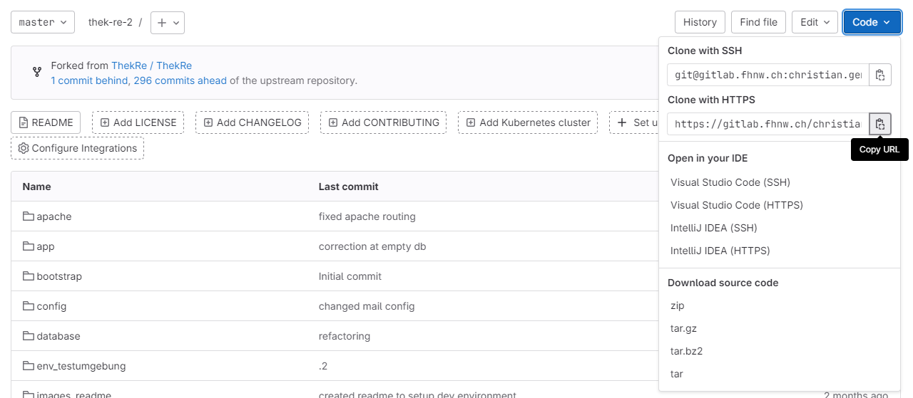
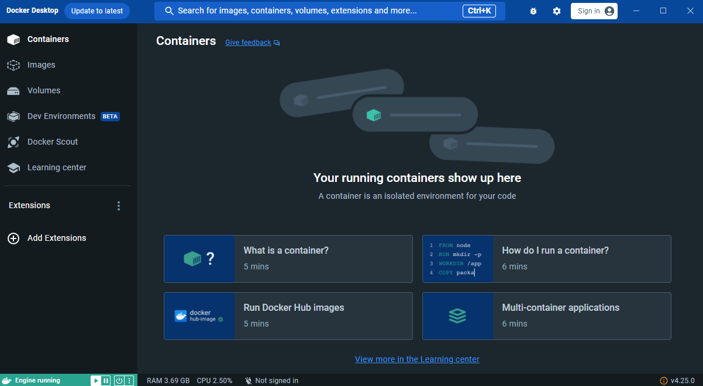
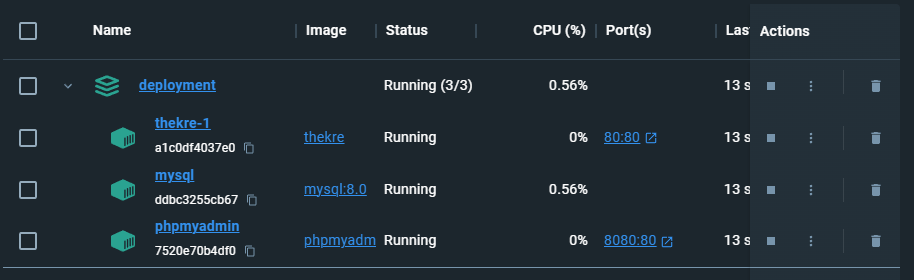
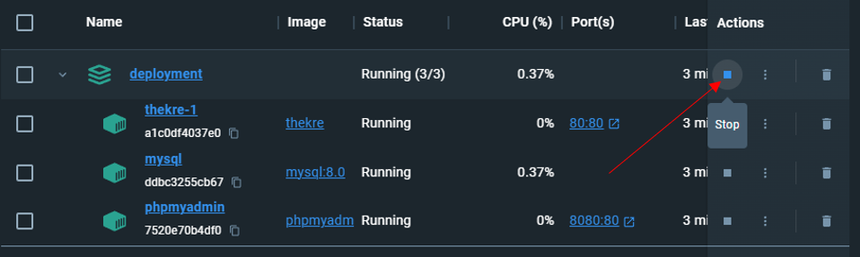
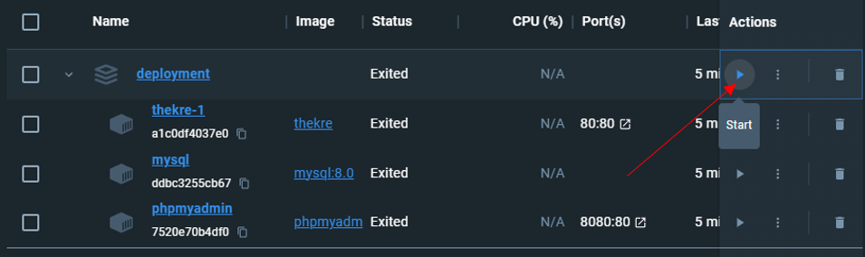

# ThekRe

ThekRe is a web application for the FHNW campus library to manage their theme boxes. 
It got setup by Maurice Meier and Nick Koch in the course of an IP5 Project and now got extended with Features by
Christian Gémesi and Ramanan Rasaiah in the course of an IP6 Project.

## Table of content
[Installation](#installation)
- [Installation Development Environment with XAMPP](#Installation Development Environment with XAMPP)
- [Installation Development Environment with Docker](#Installation Development Environment with Docker)


- [Set the Application Live on the FHNW Server](#Set the Application Live on the FHNW Server)


## Installation
### Installation Development Environment with XAMPP
In the following section, we will guide you through the installation of the development environment via XAMPP on your local machine. We prefer this method for development as the application loads quicker and it has hot-reloading. <br>
> 1. Install [XAMPP](https://sourceforge.net/projects/xampp/files/XAMPP%20Windows/8.2.4/) <br>
> Download xampp-windows-x64-8.2.4-0-VS16-installer.exe from the above Link and run the installer.
> - At Selected Components only MySQL and phpMyAdmin are required. <br>
> - The Installation folder needs to be C:\xampp <br>
> - Language: Choose your preferred language <br>
> - Click Next and wait for the installation to finish. <br>

> 2. Install [Composer](https://getcomposer.org/download/) <br>
> Download Composer-Setup.exe from the Link above and run the installer. (direct Download Link: [here](https://getcomposer.org/Composer-Setup.exe))
> - Developer mode: Uncheck the box
> - The Installation path needs to be C:\xampp\php\php.exe <br>
> - Add PHP to PATH: Check the box, if existent <br> 
> - No Proxy settings needed <br>
> - Click Next and wait for the installation to finish. <br>

> 3. Install IDE <br>
> We used PhpStorm as our IDE. You can download it [here](https://www.jetbrains.com/phpstorm/) <br>
> Note: As a student/teacher you can apply to get a free premium license
> - No special settings needed <br>

> 4. Clone the Repository <br>
> Open your IDE (in our case PHPStorm) and copy the HTTPS Link from the Project [here](https://gitlab.fhnw.ch/christian.gemesi/thek-re-2/) <br>
 <br>
> In PHPStorm go to File -> New -> Project from Version Control -> Git and paste the Link into the URL field.
> Clone the Project into the Directory "C:\xampp\htdocs\thek-re-2" (thek-re-2 Folder needs to be created) <br>

> 5. Setup Development EMail <br>
> - We used Gmail as our Email provider. Ensure you create a new fresh Gmail account, as we will place our password in plain text within the .env file. This precaution is taken to mitigate potential issues if the file is accidently pushed to Git. <br>
> - To setup, you first need to enable 2-Step Verification on your Gmail account. You can do this [here](https://myaccount.google.com/security)<br>
> - Direct Link to 2-Step Verification: [here](https://myaccount.google.com/signinoptions/two-step-verification/enroll-welcome) <br>
> - After that you can create an App Password. This password will be placed in your .env file. You can get the Password [here](https://myaccount.google.com/apppasswords) by setting an App name. Copy the password into fresh txt file to store it until we have the .env file created. <br>

> 6. Setup .env file <br>
> Create a new file called .env in C:\xampp\htdocs\thek-re-2 (Since you have the PHPStorm IDE Open you can rightclick on the thek-re-2 folder and select New -> File -> .env) and add the following values: <br>
> Replace "<<YOUR NAME HERE >>" with the name which your emails will be sent by. (We used Development) <br>
> Replace <<YOUR EMAIL HERE>> with the email address you created in step 5 <br>
> Replace <<YOUR APP PASSWORD HERE >> with the app password you created in step 5 <br>
> 
> ```
> APP_NAME=ThekRe
> APP_ENV=local
> APP_KEY=base64:OXiQSLCrUXYKg8PH2U7ulTM8cg8e5POG+H+wX4hXK4A=
> APP_DEBUG=true
> APP_LOG_LEVEL=debug
> APP_URL=http://127.0.0.1:8000
> 
> UNIQUE_SERVER_URL=themenkisten/
> 
> BROADCAST_DRIVER=log
> CACHE_DRIVER=file
> SESSION_DRIVER=file
> QUEUE_DRIVER=sync
> 
> REDIS_HOST=127.0.0.1
> REDIS_PASSWORD=null
> REDIS_PORT=6379
> 
> PUSHER_APP_ID=
> PUSHER_APP_KEY=
> PUSHER_APP_SECRET=
>
> EMAILS_FROM_NAME="<<YOUR NAME HERE>>"
> MAIL_DRIVER=smtp
> MAIL_HOST=smtp.gmail.com
> MAIL_PORT=587
> MAIL_USERNAME="<<YOUR EMAIL HERE>>"
> MAIL_PASSWORD="<<YOUR APP PASSWORD HERE>>"
> MAIL_ENCRYPTION=tls
> 
> DATABASE_DRIVER=mysql
> DATABASE_HOST=127.0.0.1
> DATABASE_PORT=3306
> DATABASE=thekre
> DATABASE_USERNAME=thekre_admin
> DATABASE_PASSWORD=cSCdrkd1VNEbk8PW
> 
> DATABASE_ROOT_PASSWORD="156deq1ws56dwq5e245864e5w6qe45w61cw5dw"
> ```

> 7. Setup Database <br>
> - Open XAMPP Control Panel and start Apache and MySQL <br>
> - Go to http://127.0.0.1/phpmyadmin/ and create a new database called "thekre" and select "utf8_general_ci" <br>
> 
> - Import the database from the file database\thekre_empty.sql <br>
> 
> - Now the database thekre with the 11 tables got generated. <br>
> 
> - After that we have to create a new database user for the system access. Go back to the homepage and then choose "Benutzerkonten" in the navigation bar and klick Benutzerkonten hinzufügen. <br>
> 
> - The hostname is localhost. The username and password are defined in the .env file. <br>
> 
> - Choose the following user privilege's and klick OK.
> 


> 8. Run the application <br>
> - Open the file C:\xampp\php\php.ini with any texteditor (we chose editor.txt) and search for the line ";extension=zip". Remove the ";" at the beginning of the line to enable the extension. <br>
> - In Your IDE open the terminal (if not already open, the terminal is located on the bottom) change into the cloned repository directory (cd <<thek-re-2>> if not already inside), and run the following commands: <br>
> - ```composer install``` <br>
> - ```php artisan key:generate``` <br>
> - ```php artisan serve``` <br>
> - Now you can open the application in your browser at http://127.0.0.1:8000/ You should see the following page: <br>
> 
> - PS: the username and password for the admin under http://127.0.0.1:8000/admin/loginForm are: username: "root@localhost", password: "root@localhost" <br>
> - PS: the password for the poweruser under http://127.0.0.1:8000/poweruser/loginForm is: "poweruser" <br>

### Installation Development Environment with Docker
In the following section, we will guide you through the installation of the dockerized environment on your local machine. Docker is used to set the application live on the FHNW Server. So it is good to also have set it up once locally for better understanding.<br>
To make the installation easier we mainly used the User Interface of the Windows OS. <br>
Keep in mind that there is no hot-reload for the dockerized environment. If you want to see changes you need to stop the container and start it again. <br>

> 1. Install [Docker](https://www.docker.com/) <br>
>    - Download the Docker Desktop Installer from [here](https://www.docker.com/products/docker-desktop) and run the installer. <br>
>    - You can verify the installation by running `docker --version` in a Terminal or run `Docker Desktop` on Windows <br>

> 2. Preparing the Folder Structure <br>
>      1. `right click -> New -> Folder` (Name: ThekRe_Webportal)
>      2.  Create a thekre_docker.sh file and paste the content from the file below:
>          ```
>          #!/bin/bash
>          echo "Creating a new folder..."
>          mkdir thekre && cd thekre || { echo "Error: Unable to create or change into thekre folder"; exit 1; }
>          echo "Folder 'thekre' created and switched to."
>          
>          echo "Cloning the repository..."
>          git clone https://gitlab.fhnw.ch/christian.gemesi/thek-re-2.git || { echo "Error: Unable to clone the repository"; exit 1; }
>          cd thek-re-2 || { echo "Error: Unable to change into thek-re-2 folder"; exit 1; }
>          echo "Repository cloned and switched to 'thek-re-2' folder."
>          
>          echo "Copying the .env file into the folder..."
>          cp '..\..\.env' . || { echo "Error: Unable to copy the .env.production file"; exit 1; }
>          echo ".env file copied."
>          
>          echo "Building the Docker image..."
>          docker compose build || { echo "Error: Unable to build the Docker image"; exit 1; }
>          echo "Docker image built successfully."
>          
>          echo "Moving back to the parent folder..."
>          cd .. || { echo "Error: Unable to change into the parent folder"; exit 1; }
>          echo "Successfully moved back to the parent folder."
>          
>          echo "Creating a new folder for deployment..."
>          mkdir deployment || { echo "Error: Unable to create the deployment folder"; exit 1; }
>          echo "Deployment folder created."
>          
>          echo "Copying docker-compose.yml into the deployment folder..."
>          cp 'thek-re-2/docker-compose.yml' deployment/ || { echo "Error: Unable to copy docker-compose.yml"; exit 1; }
>          echo "docker-compose.yml copied into the deployment folder."
>          
>          echo "Copying .env into the deployment folder..."
>          cp 'thek-re-2/.env' deployment/ || { echo "Error: Unable to copy the .env.production file"; exit 1; }
>          echo ".env file copied into the deployment folder."
>          
>          echo "Removing the 'thek-re-2' folder..."
>          rm -rf thek-re-2 || { echo "Error: Unable to remove thek-re-2 folder"; exit 1; }
>          echo "'thek-re-2' folder removed."
>          
>          echo "Changing into the deployment folder..."
>          cd deployment || { echo "Error: Unable to change into the deployment folder"; exit 1; }
>          
>          echo "Starting the Docker container in the background..."
>          docker compose up -d || { echo "Error: Unable to start the Docker container"; exit 1; }
>          echo "Docker container started successfully."
>          ```
>      3.  Create a .env file and paste the content from the file below:
>           ```
>           APP_NAME=ThekRe
>           APP_ENV=local
>           APP_KEY=base64:OXiQSLCrUXYKg8PH2U7ulTM8cg8e5POG+H+wX4hXK4A=
>           APP_DEBUG=true
>           APP_LOG_LEVEL=debug
>           APP_URL=http://127.0.0.1
>           
>           UNIQUE_SERVER_URL=themenkisten/
>           
>           BROADCAST_DRIVER=log
>           CACHE_DRIVER=file
>           SESSION_DRIVER=file
>           QUEUE_DRIVER=sync
>           
>           REDIS_HOST=127.0.0.1
>           REDIS_PASSWORD=null
>           REDIS_PORT=6379
>           
>           PUSHER_APP_ID=
>           PUSHER_APP_KEY=
>           PUSHER_APP_SECRET=
>           
>           EMAILS_FROM_NAME="<<YOUR NAME HERE>>"
>           MAIL_DRIVER=smtp
>           MAIL_HOST=smtp.gmail.com
>           MAIL_PORT=587
>           MAIL_USERNAME="<<YOUR EMAIL HERE>>"
>           MAIL_PASSWORD="<<YOUR APP PASSWORD HERE>>"
>           MAIL_ENCRYPTION=tls
>           
>           DATABASE_DRIVER=mysql
>           DATABASE_HOST=mysql
>           DATABASE_PORT=3306
>           DATABASE=thekre
>           DATABASE_USERNAME=thekre_admin
>           DATABASE_PASSWORD=cSCdrkd1VNEbk8PW
>           
>           DATABASE_ROOT_PASSWORD="156deq1ws56dwq5e245864e5w6qe45w61cw5dw"
>           ```
>      4. Replace all the "<< >>" with the respective values. See 5. and 6. of the [Installation Development Environment with XAMPP](#Installation Development Environment with XAMPP). <br>
>    
>  - After doing the steps above for the respective OS, the folder structure should look like this:
> ```
>  -folder
>  |-thekre_docker.sh
>  |-.env
>  ```

> 3. Run docker <br>
>    Open Docker Desktop and wait for the service to start. After the service is running, Docker Desktop should look like this: <br>
>    

> 4. Run the thekre_docker.sh <br>
>     1. Double click on the thekre_docker.sh file <br>
>       You can see the running container in the Docker Desktop <br>
>    
>        
>
> Note: You might be asked to enter login credentials for git (You can not use your Password, you need to create a Personal Access Token. See the instructions [here](https://docs.gitlab.com/ee/user/profile/personal_access_tokens.html#create-a-personal-access-token))

> 3. Open the application in your browser <br>
>  http://127.0.0.1/user <br>

> 4. Take the application offline <br>
>    To take the application offline you need to stop the Docker container. You can do this by clicking the "Stop" button in the Docker Desktop <br>
>    

> 4. Notes to keep in mind: <br>
>   1.  If the application is run for the first time the database needs to be importet manually. (see step 7 of the [Installation Development Environment with XAMPP](#Installation Development Environment with XAMPP))  <br>
>   2.  If the application is run for the first time the thekre_admin user does also need to be created. (see step 7 of the [Installation Development Environment with XAMPP](#Installation Development Environment with XAMPP)) <br>
>   3.  If the Website is not shown correctly (e.g. no CSS) clear the browser cache and, or history and reload the page. <br>
>   4.  If the application got taken offline, and you want to start it again, you can do so by deleting the thekre folder and running the thekre_docker.sh again or by clicking the "Start" button in the Docker Desktop <br>
>   

## Set the Application Live on the FHNW Server
In the following section, we will guide you through the installation of the dockerized environment. This will set the application Live on the FHNW Server. <br>

> 0. Connect to the FHNW Server <br>
>    - Connect to the FHNW Server via SSH <br>

> 1. Install [Docker](https://www.docker.com/) <br>
>    - Check if Docker is already installed by running `docker --version` in the Terminal. If so, skip to the next step. <br>
>    - Install Docker by running this command `sudo apt-get install docker-ce docker-ce-cli containerd.io docker-buildx-plugin docker-compose-plugin` (this will install docker and all necessary plugins) <br>

> 2. Preparing the Folder Structure <br>
>      1. `mkdir ThekRe_Webportal` (to create a new folder)
>      2.  `cd ThekRe_Webportal` (to change into the folder)
>      3. `sudo vim thekre_docker.sh` (to create a new file and open it with vim)
>      4.  click `i` to enter the insert mode and paste the content from the file below:
>           ```
>           #!/bin/bash
>           echo "Creating a new folder..."
>           mkdir thekre && cd thekre || { echo "Error: Unable to create or change into thekre folder"; exit 1; }
>           echo "Folder 'thekre' created and switched to."
>           
>           echo "Cloning the repository..."
>           git clone https://gitlab.fhnw.ch/christian.gemesi/thek-re-2.git || { echo "Error: Unable to clone the repository"; exit 1; }
>           cd thek-re-2 || { echo "Error: Unable to change into thek-re-2 folder"; exit 1; }
>           echo "Repository cloned and switched to 'thek-re-2' folder."
>           
>           echo "Copying the .env file into the folder..."
>           cp '..\..\.env' . || { echo "Error: Unable to copy the .env.production file"; exit 1; }
>           echo ".env file copied."
>           
>           echo "Building the Docker image..."
>           docker compose build || { echo "Error: Unable to build the Docker image"; exit 1; }
>           echo "Docker image built successfully."
>           
>           echo "Moving back to the parent folder..."
>           cd .. || { echo "Error: Unable to change into the parent folder"; exit 1; }
>           echo "Successfully moved back to the parent folder."
>           
>           echo "Creating a new folder for deployment..."
>           mkdir deployment || { echo "Error: Unable to create the deployment folder"; exit 1; }
>           echo "Deployment folder created."
>           
>           echo "Copying docker-compose.yml into the deployment folder..."
>           cp 'thek-re-2/docker-compose.yml' deployment/ || { echo "Error: Unable to copy docker-compose.yml"; exit 1; }
>           echo "docker-compose.yml copied into the deployment folder."
>           
>           echo "Copying .env into the deployment folder..."
>           cp 'thek-re-2/.env' deployment/ || { echo "Error: Unable to copy the .env.production file"; exit 1; }
>           echo ".env file copied into the deployment folder."
>           
>           echo "Removing the 'thek-re-2' folder..."
>           rm -rf thek-re-2 || { echo "Error: Unable to remove thek-re-2 folder"; exit 1; }
>           echo "'thek-re-2' folder removed."
>           
>           echo "Changing into the deployment folder..."
>           cd deployment || { echo "Error: Unable to change into the deployment folder"; exit 1; }
>           
>           echo "Starting the Docker container in the background..."
>           docker compose up -d || { echo "Error: Unable to start the Docker container"; exit 1; }
>           echo "Docker container started successfully."
>           ```
>      4.  type `:wq` to save the file
>      5.  `sudo vim .env` (to create a new file and open it with vim)
>      6. click `i` to enter the insert mode and paste the content from the file below:
>           ``` 
>           APP_NAME=ThekRe
>           APP_ENV=local
>           APP_KEY=base64:OXiQSLCrUXYKg8PH2U7ulTM8cg8e5POG+H+wX4hXK4A=
>           APP_DEBUG=true
>           APP_LOG_LEVEL=debug
>           APP_URL=https://www.fhnw.ch/de/die-fhnw/bibliotheken/bibliothek-brugg-windisch/themenkisten
>           
>           UNIQUE_SERVER_URL=themenkisten/
>           
>           BROADCAST_DRIVER=log
>           CACHE_DRIVER=file
>           SESSION_DRIVER=file
>           QUEUE_DRIVER=sync
>           
>           REDIS_HOST=127.0.0.1
>           REDIS_PASSWORD=null
>           REDIS_PORT=6379
>           
>           PUSHER_APP_ID=
>           PUSHER_APP_KEY=
>           PUSHER_APP_SECRET=
>           
>           EMAILS_FROM_NAME='Campusbibliothek Brugg-Windisch TESTUMGEBUNG'
>           MAIL_USERNAME="bibliothek.windisch@fhnw.ch"
>           MAIL_PASSWORD=
>           MAIL_DRIVER=smtp
>           MAIL_HOST=lmailer.ict.fhnw.ch
>           MAIL_PORT=25
>           MAIL_ENCRYPTION=null
>           
>           DATABASE_DRIVER=mysql
>           DATABASE_HOST=mysql
>           DATABASE_PORT=3306
>           DATABASE=thekre
>           DATABASE_USERNAME="thekre_admin"
>           DATABASE_PASSWORD="cSCdrkd1VNEbk8PW"
>           #Database root user in mysql per default is root
>           DATABASE_ROOT_PASSWORD="156deq1ws56dwq5e245864e5w6qe45w61cw5dw"
>           ``` 
>      6.  type `:wq` to save the file 
>      7.  After doing the steps above for the respective OS, the folder structure should look like this:
>          ```
>           -folder
>           |-thekre_docker.sh
>           |-.env
>           ```

> 3. Setup the Mail Server <br>
>    - This only needs to be done once. If youd change to another server, youd need to follow theese steps:
>    1. TODO: Add the steps to setup the Mail Server

> 4. Run docker <br>
>     1.  you can check if the service is running with `docker ps`, if no service is running start it with `sudo systemctl start docker`

> 5. Run the thekre_docker.sh <br>
>     1. `sudo chmod +x thekre_docker.sh` (to make the file executable)
>     2. `sudo ./thekre_docker.sh` (to run the file)
> 
> Note: You might be asked to enter login credentials for git (You can not use your Password, you need to create a Personal Access Token. See the instructions [here](https://docs.gitlab.com/ee/user/profile/personal_access_tokens.html#create-a-personal-access-token))

> 6. Open the application in your browser <br>
>    https://www.fhnw.ch/de/die-fhnw/bibliotheken/bibliothek-brugg-windisch/themenkisten

> 7. Take the application offline <br>
>    To take the application offline you need to stop the Docker container. You need to change into the deployment folder and run the following command: <br>
>    `docker compose down` <br>

> 8. Notes to keep in mind: <br>
>    1.  If the application is run for the first time the database needs to be importet manually. (see step 7 of the [Installation Development Environment](#Installation Development Environment))  <br>
>    2.  If the application is run for the first time the thekre_admin user does also need to be created. (see step 7 of the [Installation Development Environment](#Installation Development Environment)) <br>
>    3.  If the Website is not shown correctly (e.g. no CSS) clear the browser cache and, or history and reload the page. <br>
>    4.  **If you took down the docker container you can also delete the thekre folder to restart the script. The Database WONT BE LOST. ALL ENTRIES STILL REMAIN AFTER RESTARTING THE SCRIPT.**
